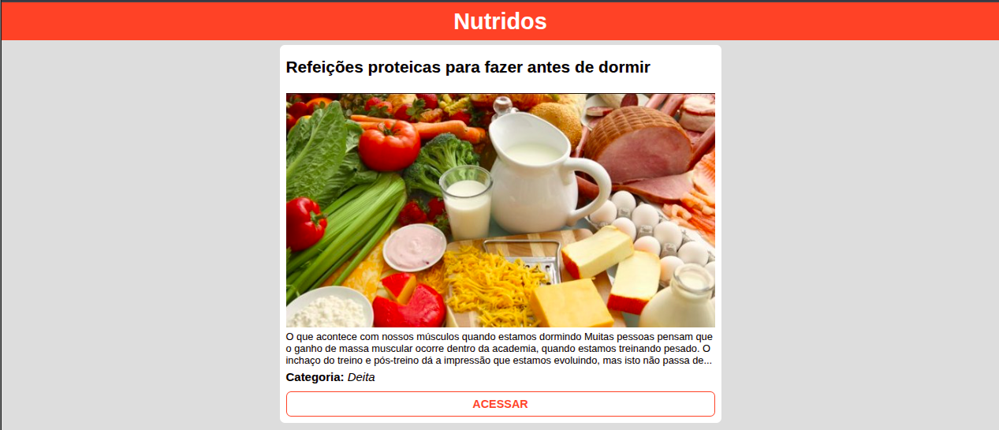

# 🥗 Nutridos

O **Nutridos** é uma aplicação web desenvolvida em React para listar posts, dicas e artigos focados em nutrição, emagrecimento e saúde. O projeto consome dados de uma API externa em tempo real e os renderiza na tela de forma limpa, responsiva e dinâmica.

---

## 📸 Demonstração do Projeto



---

## 🛠️ Tecnologias e Recursos Utilizados

O projeto foi construído utilizando o ecossistema moderno do React, estilização nativa e boas práticas de consumo de dados:

- **React + Vite**: Ferramenta de build extremamente rápida para criar e gerenciar a estrutura do projeto.
- **CSS Puro (CSS3)**: Estilização customizada e responsiva feita do zero, sem o uso de frameworks externos.
- **useState**: Hook do React utilizado para armazenar e gerenciar a lista de posts recebida da API.
- **useEffect**: Hook utilizado para controlar o ciclo de vida do componente e disparar a requisição HTTP assim que a página é carregada.
- **HTTP & Fetch API**: Método nativo do JavaScript utilizado para consumir os dados de forma assíncrona.
- **Método `.map()`**: Função de array que percorre os objetos retornados e renderiza dinamicamente a estrutura de cada post.

---

## 🔌 API Consumida

Os dados exibidos na aplicação são consumidos a partir do seguinte endpoint:

- **URL da API:** `https://sujeitoprogramador.com/rn-api/?api=posts`

### Exemplo de estrutura dos dados recebidos:

```json
{
  "id": 1,
  "titulo": "Refeições proteicas para fazer antes de dormir",
  "capa": "https://sujeitoprogramador.com...",
  "subtitulo": "O que acontece com nossos músculos quando estamos dormindo...",
  "categoria": "Dieta"
}
```

---

## 🚀 Como Executar o Projeto

Siga os passos abaixo para rodar a aplicação localmente:

1. Clone o repositório:

   ```bash
   git clone https://github.com
   ```

2. Entre na pasta do projeto:

   ```bash
   cd nutridos
   ```

3. Instale as dependências:

   ```bash
   npm install
   ```

4. Inicie o servidor de desenvolvimento:

   ```bash
   npm run dev
   ```

5. Abra o navegador no endereço indicado pelo Vite (geralmente `http://localhost:5173`).
